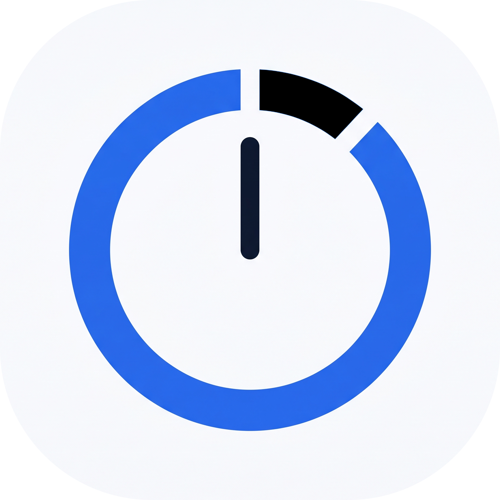

# ⏱️ چند ساعت؟ (ChandSaat) - نسخه 0.1.0

<div align="center">



**نرم‌افزار مدرن مدیریت، ثبت و تحلیل ساعات مطالعه روزانه و تست‌زنی دسکتاپ**

[](https://github.com/yahaiz/chand-saat/actions)
[](https://python.org)
[](https://fastapi.tiangolo.com)
[](https://pywebview.flowrl.com)
[](https://sqlite.org)
[](LICENSE)

</div>

---

## 📖 درباره برنامه

**«چند ساعت؟»** یک دستیار هوشمند و مدرن دسکتاپ برای داوطلبان کنکور، دانشجویان و علاقه‌مندان به برنامه‌ریزی دقیق است. این برنامه با ترکیب قدرت وب-تکنولوژی‌های مدرن (FastAPI و TailwindCSS) و پنجره نیتیو دسکتاپ (PyWebView)، تجربه‌ای بسیار روان، زیبا و بدون لَگ را فراهم می‌کند.

> 💡 **داستان توسعه پروژه (Vibe Coding Note):**
> 
> شاید براتون جالب باشه دونید که ایده و نسخه اولیه این پروژه طی یک جلسه جذاب **Vibe Coding** متولد شد! 🎧⚡️ اما از اونجایی که ما به پایداری اهمیت می‌دیم، کل کدها از ساختار اولیه یکپارچه (Monolithic) به‌طور کامل ریفاکتور شدند و به یک **معماری پاک و صنعتی (Clean Modular Architecture)** با دیتابیس SQLite، تست‌های خودکار Pytest و خط لوله CI/CD گیتهاب تبدیل شد! یعنی هم هیجان Vibe Coding رو داره و هم اصالت مهندسی نرم‌افزار.

---

## ✨ امکانات اصلی

- ⏱️ **تایمر اختصاصی پومودورو (Pomodoro Timer):** همراه با چیپ‌های هوشمند زمان‌بندی و یادآوری استراحت.
- 📊 **تحلیل آمار و پیشرفت روزانه:** محاسبه درصد تحقق اهداف ساعات مطالعه و تعداد تست با نمودار دایره‌ای تعاملی.
- 🗄️ **پایگاه داده سریع SQLite:** ذخیره‌سازی امن و سریع با قابلیت انتقال اتوماتیک داده‌های قبلی.
- 📥 **خروجی اکسل (Excel Export):** خروجی‌گیری آنی از تمامی سوابق مطالعه با یک کلیک.
- 🖥️ **رابط کاربری دسکتاپ نیتیو (High-DPI Ready):** کنترل‌های اختصاصی پنجره (مینیمایز، ماکزیمایز، بستن) و اسپلش اسکرین باکیفیت شفاف.
- ⚙️ **مدیریت درس‌ها و اهداف:** امکان سفارشی‌سازی لیست دروس، زمان پومودورو و اهداف روزانه.

---

## 🛠️ تکنولوژی‌های استفاده‌شده

| لایه | تکنولوژی |
| :--- | :--- |
| **Backend Framework** | [FastAPI](https://fastapi.tiangolo.com/) |
| **ASGI Server** | [Uvicorn](https://www.uvicorn.org/) |
| **Desktop Wrapper** | [PyWebView](https://pywebview.flowrl.com/) |
| **Database** | [SQLite3](https://sqlite.org/) |
| **UI & Styling** | Vanilla CSS3, TailwindCSS (CDN), Vazirmatn Font |
| **Packaging & CI/CD** | PyInstaller, Inno Setup 6, GitHub Actions |

---

## 🏛️ ساختار معماری پروژه (Clean Architecture)

```
chand-saat/
│── core/
│   ├── config.py              # تنظیمات متمرکز، لاگر، مسیر AppData و High-DPI
│── database/
│   ├── db.py                  # ارتباط با SQLite و سیستم انتقال داده‌های قدیمی
│   └── repository.py          # لایه CRUD و خروجی‌گیری اکسل
│── services/
│   └── settings_service.py    # مدیریت فایل settings.json و قفل همزمانی
│── routes/
│   ├── pages.py               # اندپکیک رندر داشبورد
│   ├── entries.py             # اندپکیک‌های ثبت و حذف سوابق
│   └── settings_routes.py     # اندپکیک‌های تنظیمات و دانلود اکسل
│── ui/
│   ├── splash.py              # اسپلش اسکرین شفاف با Tkinter
│   └── window.py              # ساخت پنجره PyWebView و WindowAPI
│── static/
│   ├── css/styles.css         # انیمیشن‌ها و استایل‌های سفارشی
│── templates/
│   └── index.html             # قالب اصلی برنامه
│── tests/
│   ├── test_database.py       # تست‌های واحد دیتابیس
│   └── test_api.py            # تست‌های اندپکیک‌های API
│── design/
│   └── psd/                   # فایل‌های اصلی فتوشاپ (سورس گرافیک)
│── .github/workflows/
│   └── build.yml              # خط لوله CI/CD گیتهاب جهت ساخت اتوماتیک ریلیز
│── main.py                    # نقطه ورود اصلی برنامه
│── make_release.py            # اسکریپت کامپایل محلی PyInstaller و Inno Setup
│── ChandSaat.spec             # کانفیگ PyInstaller
│── setup.iss                  # اسکریپت ویزارد نصب‌کننده Inno Setup
```

---

## 🚀 راهنمای نصب و اجرای سورس کد

### پیش‌نیازها:
- پایتون نسخه 3.10 یا بالاتر

### ۱. کلون کردن مخزن:
```bash
git clone https://github.com/yahaiz/chand-saat.git
cd chand-saat
```

### ۲. ساخت محیط مجازی و نصب وابستگی‌ها:
```bash
python -m venv .venv
# در ویندوز:
.\.venv\Scripts\activate

pip install -r requirements.txt
```

### ۳. اجرای برنامه:
```bash
python main.py
```

### ۴. اجرای تست‌های خودکار:
```bash
pytest -v
```

---

## 📦 نحوه ساخت فایل نصب‌کننده (Build Setup & Portable)

با اجرای دستور زیر، فایل نصب‌کننده ویندوز (`ChandSaat_Setup_v0.1.0.exe`) و پکیج پرتابل (`ChandSaat_v0.1.0_Portable.zip`) به صورت خودکار ساخته می‌شوند:

```bash
python make_release.py
```

> 🤖 **توجه:** به لطف **GitHub Actions**، با هر `push` یا `release` روی مخزن گیتهاب، فایل‌های خروجی به طور خودکار کامپایل شده و در بخش **Actions / Releases** گیتهاب قابل دانلود هستند!

---

## 📄 لایسنس

این پروژه تحت لایسنس [MIT](LICENSE) منتشر شده است. استفاده و توسعه آن برای عموم آزاد است.
